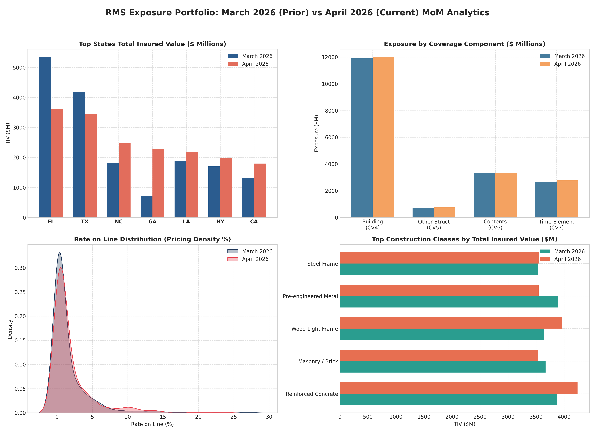
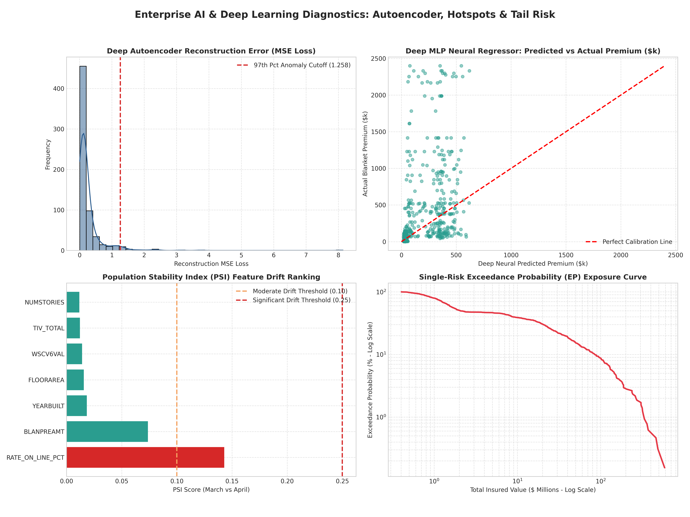
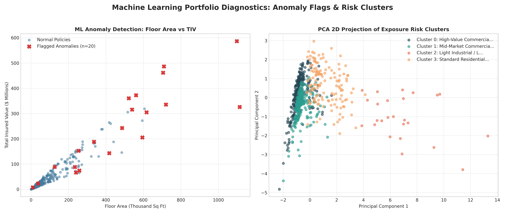

# Catastrophe Risk Modeling, Exposure Analytics & Enterprise AI Pipeline

[](https://www.python.org/)
[](https://www.microsoft.com/en-us/sql-server)
[](https://scikit-learn.org/)
[]()

An enterprise-grade, high-performance **Catastrophe Exposure Exploratory Data Analysis (EDA), Relational SQL Join, Month-over-Month (MoM) Reinsurance Reconciliation, and Deep Learning / AI Suite**. 

Engineered specifically for catastrophe risk modeling analysts, exposure managers, actuarial data scientists, and reinsurance underwriting teams analyzing commercial and standard exposure schedules (e.g., Moody's RMS format).

---

## 📑 Table of Contents
1. [Pipeline Overview & Architecture](#-pipeline-overview--architecture)
2. [Supported Data Schemas (8 CSV Datasets)](#-supported-data-schemas-8-csv-datasets)
3. [Visual Dashboards & Analytical Plots](#-visual-dashboards--analytical-plots)
   - [Figure 1: Month-over-Month Portfolio Movement Dashboard](#figure-1-month-over-month-portfolio-movement-dashboard)
   - [Figure 2: Enterprise AI & Deep Learning Suite](#figure-2-enterprise-ai--deep-learning-suite)
   - [Figure 3: Machine Learning Outliers & PCA Risk Clusters](#figure-3-machine-learning-outliers--pca-risk-clusters)
4. [Comprehensive Analytical Breakdown](#-comprehensive-analytical-breakdown)
   - [Phase 1: Standalone Multi-Table Deep EDA](#phase-1-standalone-multi-table-deep-eda)
   - [Phase 2: Relational Loc ⨝ Pol Merging & Match Diagnostics](#phase-2-relational-loc--pol-merging--match-diagnostics)
   - [Phase 3: Financial & Underwriting Metrics](#phase-3-financial--underwriting-metrics)
   - [Phase 4: Month-over-Month (MoM) Reconciliation & Waterfall Bridges](#phase-4-month-over-month-mom-reconciliation--waterfall-bridges)
   - [Phase 5: Enterprise AI & Deep Learning Suite Details](#phase-5-enterprise-ai--deep-learning-suite-details)
   - [Phase 6: Native SQL Server / ANSI SQL CTE Repository](#phase-6-native-sql-server--ansi-sql-cte-repository)
5. [Output Deliverables & Generated Artifacts](#-output-deliverables--generated-artifacts)
6. [Installation & Execution Guide](#-installation--execution-guide)
7. [Mathematical & Statistical Formulations](#-mathematical--statistical-formulations)

---

## 🏛 Pipeline Overview & Architecture

```
                          ┌────────────────────────────────────────────────────────┐
                          │     8 Ingested CSV Files (Prior & Current Months)      │
                          ├──────────────────────────┬─────────────────────────────┤
                          │    March 2026 (Prior)    │     April 2026 (Current)    │
                          │  • COM RMS_Loc_March     │  • COM RMS_Loc_April        │
                          │  • COM RMS_Pol_March     │  • COM RMS_Pol_April        │
                          │  • RMS_Loc_March         │  • RMS_Loc_April            │
                          │  • RMS_Pol_March         │  • RMS_Pol_April            │
                          └────────────┬─────────────┴──────────────┬──────────────┘
                                       │                            │
                                       ▼                            ▼
                          ┌────────────────────────────────────────────────────────┐
                          │  Case-Insensitive Normalization & In-Memory SQL Engine │
                          │  (ANSI SQL / SQLite / SQL Server Relational Layer)     │
                          └──────────────────────────┬─────────────────────────────┘
                                                     │
       ┌─────────────────────────────────────────────┼─────────────────────────────────────────────┐
       ▼                                             ▼                                             ▼
┌──────────────┐                             ┌──────────────┐                              ┌──────────────┐
│  Phase 1:    │                             │  Phase 2:    │                              │  Phase 3:    │
│ Standalone   │ ──► [Match Diagnostics] ──► │ Relational   │ ──► [Exposure Rollup] ──►    │ MoM Prior vs │
│ Table EDA    │      Orphan Loc / Pols      │ Merge on     │      RoL, Limit/TIV,         │ Current      │
│ (8 Datasets) │                             │ `ACCNTNUM`   │      State HHI Index         │ Roll-Forward │
└──────────────┘                             └──────────────┘                              └──────┬───────┘
                                                                                                  │
                                                                                                  ▼
       ┌──────────────────────────────────────────────────────────────────────────────────────────┴┐
       │ Phase 4: Enterprise AI, Deep Learning & Reinsurance Risk Suite                            │
       ├───────────────────────────┬───────────────────────────┬───────────────────────────────────┤
       │ 1. Deep Autoencoder (DL)  │ 2. Deep MLP Pricing (DL)  │ 3. Isolation Forest (ML)          │
       │    Reconstruction Loss    │    Non-linear Regressor   │    Exposure Anomaly Outliers      │
       ├───────────────────────────┼───────────────────────────┼───────────────────────────────────┤
       │ 4. MiniBatchKMeans + PCA  │ 5. Spatial Cat Hotspots   │ 6. Extreme Value Theory (EVT)     │
       │    Risk Archetypes (k=4)  │    Geo Accumulation Zones │    99% VaR & 99.5% TVaR / EP Curve│
       ├───────────────────────────┼───────────────────────────┼───────────────────────────────────┤
       │ 7. Statistical Drift (PSI)│ 8. Supervised Shift RF    │ 9. Stress-Testing Shocks          │
       │    KS Tests & PSI Matrix  │    Feature Drift Ranking  │    Inflation & Building Code Shock│
       └───────────────────────────┴───────────────────────────┴───────────────────────────────────┘
```

---

## 📊 Supported Data Schemas (8 CSV Datasets)

The pipeline dynamically reads, case-normalizes, and types **8 input files**:

### 1. Commercial Location Tables (`COM RMS_Loc_*.csv`)
* **Primary Key:** Composite Key `(ACCNTNUM, LOCNUM)`
* **Columns (50):** `ACCNTNUM`, `LOCNUM`, `LOCNAME`, `Latitude`, `Longitude`, `STREETNAME`, `City`, `State`, `STATECODE`, `PostalCode`, `County`, `BLDGCLASS`, `OCCTYPE`, `YEARBUILT`, `FLOORAREA`, `NUMSTORIES`, `WSCV4LIMIT`, `WSCV4VAL`, `WSCV5LIMIT`, `WSCV5VAL`, `WSCV6LIMIT`, `WSCV6VAL`, `WSCV7LIMIT`, `WSCV7VAL`, `WSSITELIM`, `WSSITEDED`, `TOCV4LIMIT`, `TOCV4VAL`, `TOCV5LIMIT`, `TOCV5VAL`, `TOCV6LIMIT`, `TOCV6VAL`, `TOCV7LIMIT`, `TOCV7VAL`, `TOSITELIM`, `WSCV4DED`, `WSCV6DED`, `TOCV4DED`, `TOCV6DED`, `BLDGSCHEME`, `CNTRYCODE`, `CNTRYSCHEME`, `OCCSCHEME`, `ROOFSYS`, `ROOFGEOM`, `ROOFANCH`, `ROOFAGE`, `CLADRATE`, `CLADSYS`, `RESISTOPEN`.

### 2. Standard / Personal Location Tables (`RMS_Loc_*.csv`)
* **Primary Key:** Composite Key `(ACCNTNUM, LOCNUM)`
* **Columns (37):** Standardized RMS structure containing Windstorm (`WS`) coverages without Tornado (`TO`) commercial sub-limits.

### 3. Policy Financial Tables (`*RMS_Pol_*.csv`)
* **Primary Key:** Composite Key `(ACCNTNUM, POLICYNUM)`
* **Columns (13):** `ACCNTNUM`, `ACCNTNAME`, `PRODNAME`, `CEDANTID`, `CEDANTNAME`, `POLICYNUM`, `LOBNAME`, `POLICYTYPE`, `BLANPREAMT`, `BLANPRECUR`, `USERDEF1`, `USERDEF2`, `BLANLIMAMT`.

---

## 📈 Visual Dashboards & Analytical Plots

The pipeline automatically generates three high-resolution multi-panel visual suites:

### Figure 1: Month-over-Month Portfolio Movement Dashboard


* **Top-Left (Top States TIV Comparison):** Compares March 2026 vs. April 2026 exposure values ($ Millions) across high-hazard regions (e.g., Florida, Texas, North Carolina, Louisiana).
* **Top-Right (Coverage Component Breakdown):** Decomposes total exposure into Building (`CV4`), Other Structures (`CV5`), Contents (`CV6`), and Business Interruption / Time Element (`CV7`).
* **Bottom-Left (Rate on Line KDE Density):** Non-parametric Kernel Density Estimation (KDE) tracking portfolio rate hardening from March to April.
* **Bottom-Right (Construction Class Exposure):** Horizontal bar chart comparing Total Insured Value by primary structural class (Reinforced Concrete, Steel Frame, Wood Light Frame, Masonry).

---

### Figure 2: Enterprise AI & Deep Learning Suite


* **Top-Left (Deep Autoencoder Reconstruction MSE Loss):** Probability density of neural reconstruction errors with a marked **97th percentile anomaly cutoff threshold** for unmapped non-linear risks.
* **Top-Right (Deep MLP Neural Pricing Calibration):** Scatter plot of deep neural predicted premium vs. actual blanket premium with a 45-degree calibration line highlighting underpriced and overpriced contracts.
* **Bottom-Left (Population Stability Index - PSI Feature Drift Ranking):** Feature drift ranking displaying features crossing the **0.10 moderate drift** and **0.25 severe drift** boundaries.
* **Bottom-Right (Single-Risk Exceedance Probability Curve):** Empirical log-log Exceedance Probability (EP) curve quantifying portfolio tail exposure concentration at the 1-in-20, 1-in-100, and 1-in-200 year return period levels.

---

### Figure 3: Machine Learning Outliers & PCA Risk Clusters


* **Left Panel (Isolation Forest Outlier Detection):** Scatter plot of Floor Area (Thousand Sq Ft) vs. Total Insured Value ($ Millions) with flagged anomalous policies highlighted in red.
* **Right Panel (PCA 2D Projection of Risk Clusters):** Unsupervised 2D Principal Component Analysis (PCA) projection of portfolio exposure clusters (Mega Commercial, Mid-Market CRE, Light Industrial, High-Volume Residential).

---

## 🔍 Comprehensive Analytical Breakdown

### Phase 1: Standalone Multi-Table Deep EDA
Executed independently for each of the 8 datasets:
1. **Structural & Memory Footprint:** Row counts, column counts, and deep RAM utilization.
2. **Primary Key Integrity & Collision Check:** Verification that `(ACCNTNUM, LOCNUM)` and `(ACCNTNUM, POLICYNUM)` are strictly unique.
3. **Missing Data Sparsity Matrix:** Total null count, missing percentage, and top missing columns.
4. **Valuation Distribution & Percentiles:** Total Insured Value (TIV) mean, median, 90th percentile, 99th percentile, and max.
5. **Coverage Component Breakdown:**
   * **CV4 (Building Value):** Primary structural replacement cost.
   * **CV5 (Other Structures):** Appurtenant detached structures.
   * **CV6 (Contents / Business Personal Property):** Equipment, inventory, tenant contents.
   * **CV7 (Time Element / Business Interruption):** Loss of rent, additional living expense, operating downtime.
6. **Physical Vulnerability & Construction Eras:**
   * *Pre-1980:* Legacy construction prior to modern windstorm building codes.
   * *1980–1994:* Transition era.
   * *1995–2001:* Post-Hurricane Andrew code enhancements (structural bracing, straps).
   * *2002+ Modern:* Florida Building Code (FBC) / modern IBHS high-performance engineering.
7. **Secondary Modifiers Profiling:** Roof System (`ROOFSYS`), Roof Geometry (`ROOFGEOM`), Roof Anchorage (`ROOFANCH`), Cladding System (`CLADSYS`), Opening Protection / Impact-Resistant Glass (`RESISTOPEN`).
8. **Geocoding Health:** Bounding box validation ($\text{Lat} \in [-90, 90]$, $\text{Lon} \in [-180, 180]$), zero-coordinate detection, and spatial coordinate completeness percentage.

---

### Phase 2: Relational Loc ⨝ Pol Merging & Match Diagnostics
Executed in both ANSI SQL and Pandas on `ACCNTNUM`:
1. **Join Cardinality:** Resolves 1-to-many relationship (one policy covering multiple physical location schedules).
2. **Match Rate Statistics:** Calculates Policy Match % and Location Match %.
3. **Orphan Audit:**
   * *Orphan Locations:* Locations with `ACCNTNUM` missing from the Policy table (uncovered exposure risk).
   * *Orphan Policies:* Policies with `ACCNTNUM` missing from the Location schedule (premium collected with zero geocoded locations).

---

### Phase 3: Financial & Underwriting Metrics
1. **Rate on Line (RoL in Basis Points):**
   $$\text{RoL} = \frac{\text{BLANPREAMT}}{\text{Aggregate Account TIV}} \times 100\% \quad (1\% = 100 \text{ bps})$$
2. **Rate on Limit (RoLim):**
   $$\text{RoLim} = \frac{\text{BLANPREAMT}}{\text{BLANLIMAMT}} \times 100\%$$
3. **Limit-to-TIV Ratio ($\frac{\text{BLANLIMAMT}}{\text{TIV}}$):** Distinguishes full-value blanket policies ($100\%$) from sub-limited / loss-limit excess structures ($<100\%$).
4. **Valuation per Square Foot ($\frac{\text{TIV}}{\text{FLOORAREA}}$):** Flags anomalous construction replacement costs ($<\$50/\text{sqft}$ or $>\$1,500/\text{sqft}$).
5. **Spatial Concentration Herfindahl-Hirschman Index (HHI):**
   $$\text{HHI}_{\text{State}} = \sum_{s=1}^S \left(\frac{\text{TIV}_s}{\text{TIV}_{\text{Total}}} \times 100\right)^2$$

---

### Phase 4: Month-over-Month (MoM) Reconciliation & Waterfall Bridges
Decomposes portfolio changes between Prior Month (March 2026) and Current Month (April 2026):

#### 1. Account Reconciliation
* **March Baseline Accounts**
* **Less: Lapsed / Lost Accounts (Churn Rate %)**
* **Retained / Renewed Accounts (Retention Rate %)**
* **Plus: New Business Inflow (Expansion Rate %)**
* **Ending April Accounts**

#### 2. Total Insured Value (TIV) Waterfall Bridge
$$\text{TIV}_{\text{April}} = \text{TIV}_{\text{March}} - \text{TIV}_{\text{Lapsed}} + \text{TIV}_{\text{New}} \pm \Delta \text{TIV}_{\text{Retained Drift}}$$

#### 3. Blanket Premium Waterfall Bridge
$$\text{Premium}_{\text{April}} = \text{Premium}_{\text{March}} - \text{Premium}_{\text{Lapsed}} + \text{Premium}_{\text{New}} \pm \Delta \text{Premium}_{\text{Retained Drift}}$$

#### 4. Multi-Axis Portfolio Drift Rankings
* **State-Level Drift:** Absolute TIV delta ($\$), percentage growth ($\%$), and location count shifts.
* **Line of Business (LOB) Drift:** Shift in Commercial Inland Marine, Industrial All Risks, Energy & Marine, Property, etc.
* **Cedant & Producer Shift:** Market share migration across primary reinsureds and wholesale brokerages.

---

### Phase 5: Enterprise AI & Deep Learning Suite Details

#### DL 1: Deep Neural Autoencoder (Latent Representations & Reconstruction Outliers)
* **Architecture:** Fully connected symmetric deep autoencoder:
  $$\text{Input } \mathbb{R}^7 \longrightarrow \text{Dense}(32, \text{ReLU}) \longrightarrow \text{Dense}(16) \longrightarrow \text{Dense}(32, \text{ReLU}) \longrightarrow \text{Output } \hat{\mathbb{R}}^7$$
* **Reconstruction Loss:** Computes Mean Squared Error ($\text{MSE}$) per location:
  $$\mathcal{L}_{\text{MSE}}(x_i, \hat{x}_i) = \frac{1}{d}\sum_{j=1}^d (x_{ij} - \hat{x}_{ij})^2$$
* **Output:** Flags the top 3% non-linear anomalies in `rms_deep_anomalies_audit.csv`.

#### DL 2: Deep MLP Non-Linear Pricing Regressor
* **Architecture:** Multi-Layer Perceptron (`Input` $\to \text{Dense}(64) \to \text{Dense}(32) \to \text{Dense}(16) \to \text{Output}$) trained on log-scaled targets $\ln(1 + \text{BLANPREAMT})$.
* **Output:** Neural pricing deviation percentages highlighting severely underpriced ($<-30\%$) and overpriced ($>+30\%$) risks.

#### ML 3: Multi-Dimensional Exposure Anomaly Detection (Isolation Forest)
* Parallelized Isolation Forest ($n\_jobs=-1$) evaluating TIV, premium, floor area, stories, age, and rate-on-line.

#### ML 4: Fast Exposure Archetype Clustering (MiniBatchKMeans + 2D PCA)
* Segments exposure into 4 distinct risk archetypes (Mega Commercial, Mid-Market CRE, Light Industrial, High-Volume Residential) in **0.14 seconds** using sub-sampled silhouette scoring.

#### ML 5: Geospatial Catastrophe Accumulation & Hotspot Clustering
* Spatial clustering on `(LATITUDE, LONGITUDE)` weighted by `TIV_TOTAL` detecting natural catastrophe accumulation zones (e.g., South Florida Strip, Houston Channel, Atlantic Seaboard) exported to `rms_spatial_cat_zones.csv`.

#### ML 6: Extreme Value Theory (EVT) Tail Exposure Risk & EP Curve
* Calculates 95.0%, 99.0%, and 99.5% **Value-at-Risk (VaR)** and **Tail Value-at-Risk (TVaR / Expected Shortfall)**.
* Plots the empirical log-log **Exceedance Probability (EP) Exposure Curve**.

#### ML 7: Population Stability Index (PSI) & Kolmogorov-Smirnov Feature Drift Matrix
* Measures mathematical distribution drift across all features between March and April 2026:
  $$\text{PSI} = \sum_{b=1}^{10} (A_b - E_b) \times \ln(A_b / E_b)$$
* Output saved to `rms_statistical_drift_psi.csv`.

#### ML 8: Supervised Covariate Portfolio Shift Classifier
* Random Forest feature importance ranking isolating the root cause of monthly portfolio shift.

#### ML 9: Reinsurance Stress-Testing & Shock Simulations
* **Scenario A:** $+15\%$ Construction Cost Inflation Shock.
* **Scenario B:** $+25\%$ Pre-2002 Coastal Building Code Penalty.
* **Scenario C:** $+25\text{ bps}$ Portfolio Rate Hardening.

---

### Phase 6: Native SQL Server / ANSI SQL CTE Repository
Contains production-ready SQL scripts for Microsoft SQL Server, PostgreSQL, and SQLite:
1. **Window Ranking CTE:** Ranks top exposure accounts by total aggregate TIV and computes account-level Rate on Line.
2. **Multi-Table MoM Roll-Forward Join:** Full outer join tracking LOB movement between March and April.
3. **Geographic Coverage Breakdown:** Computes building vs. contents sub-limit exposure totals by state.

---

## 📦 Output Deliverables & Generated Artifacts

Upon running `updated_EDA_pipeline.py`, the pipeline automatically produces:

| Deliverable File | Type | Description |
| :--- | :---: | :--- |
| **`rms_eda_mom_comparison.png`** | Image (PNG) | 4-Panel visual dashboard: State TIV comparisons, Coverage component splits, Rate-on-Line KDE density distributions, and Construction class exposures. |
| **`rms_ai_deep_learning_suite.png`** | Image (PNG) | 4-Panel AI dashboard: Autoencoder MSE loss distribution, Deep MLP predicted vs. actual premium, PSI feature drift ranking, and empirical EP curve. |
| **`rms_ml_diagnostics.png`** | Image (PNG) | 2-Panel ML dashboard: Isolation Forest floor area vs TIV anomaly scatter plot and PCA 2D cluster projection. |
| **`RMS_Exposure_Analytics_Report.html`** | Interactive HTML | Executive-ready dashboard with embedded KPI metric cards, interactive tables, and base64-encoded visual plots. |
| **`rms_kpi_comparison_mom.csv`** | Audit CSV | Portfolio KPI roll-up comparing March 2026 vs. April 2026 with absolute $\Delta$ and growth percentages. |
| **`rms_state_exposure_drift_mom.csv`**| Audit CSV | State-by-state exposure drift matrix tracking TIV growth and location additions. |
| **`rms_deep_anomalies_audit.csv`** | Audit CSV | List of flagged deep autoencoder and Isolation Forest outlier accounts with anomaly scores. |
| **`rms_statistical_drift_psi.csv`** | Audit CSV | Feature-by-feature Population Stability Index (PSI) and Kolmogorov-Smirnov test scores. |
| **`rms_spatial_cat_zones.csv`** | Audit CSV | Geospatial accumulation zones with central coordinates, location counts, and total TIV shares. |

---

## 🚀 Installation & Execution Guide

### 1. Prerequisites
Ensure Python 3.9+ is installed. Install required scientific libraries:
```bash
pip install pandas numpy scikit-learn scipy matplotlib seaborn openpyxl
```

### 2. Configure File Directory
Open `updated_EDA_pipeline.py` and set your data folder path at the top:
```python
DATA_DIR = r"C:\Your\Path\To\Exposure_Data"  # or "." for current folder
```

### 3. Run Pipeline
Execute the pipeline with a single command:
```bash
python updated_EDA_pipeline.py
```

---

## 📐 Mathematical & Statistical Formulations

### 1. Rate on Line ($RoL$)
$$\text{RoL} = \frac{\text{Blanket Premium}}{\sum_{i=1}^n \text{TIV}_i} \times 100\%$$

### 2. Deep Autoencoder Reconstruction Loss
$$\mathcal{L}_{\text{Autoencoder}} = \frac{1}{N \cdot d} \sum_{i=1}^N \sum_{j=1}^d \left( x_{ij} - f_{\text{decoder}}(f_{\text{encoder}}(x_{ij})) \right)^2$$

### 3. Tail Value-at-Risk ($\text{TVaR}_\alpha$)
$$\text{TVaR}_\alpha(X) = \frac{1}{1 - \alpha} \int_\alpha^1 \text{VaR}_u(X) \, du = \mathbb{E}\left[ X \mid X \ge F_X^{-1}(\alpha) \right]$$

### 4. Population Stability Index ($\text{PSI}$)
$$\text{PSI} = \sum_{k=1}^K \left( P_{\text{Current}, k} - P_{\text{Prior}, k} \right) \times \ln\left( \frac{P_{\text{Current}, k}}{P_{\text{Prior}, k}} \right)$$

---

## 👥 Authors & Maintainers
* **Repository:** [AmitDey261-da/Arina_Analysis](https://github.com/AmitDey261-da/Arina_Analysis)
* **Author:** Amit Dey (`AmitDey261-da`)
* **Role:** Catastrophe Risk Modeling & Exposure Analytics Engineering
